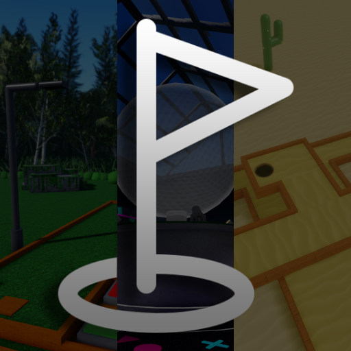
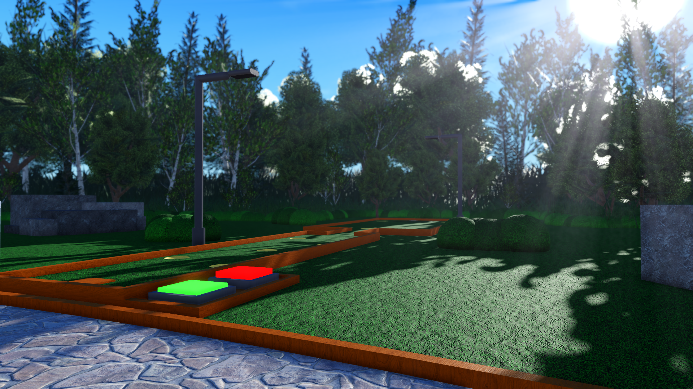
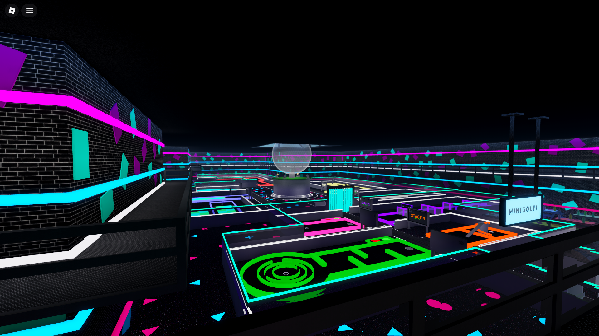
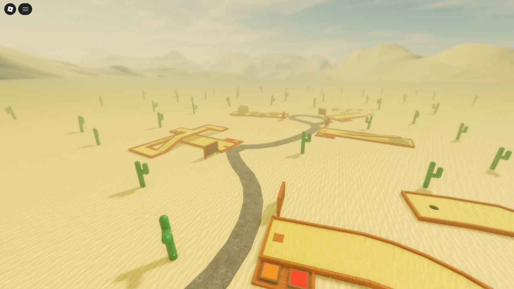

# Roblox Minigolf
A multiple environment minigolf game built in Roblox Studio.



## Platforms supported:
- Windows
- Mac
- Linux (Sober, **unofficial**)
- Android & IOS

## How to play:
- **A**: If you have a Roblox account that is 16+ FAE/ID verified, play using **[this link](https://www.roblox.com/games/11200475351/Minigolf)**.
  - If you don't, to make a Roblox account, visit [roblox.com](https://www.roblox.com). 
  - After signing up, complete the verification steps in Settings -> Account Info. 
      - The required **F**acial **A**ge **E**stimation/Identification check is out of my control.
  - Upon pressing play, installation of the client will be automatically prompted.
- **B**: If your account isn't verified, then clone the repository and set it up in Roblox Studio. (Refer to "How to run & edit locally")
- **C**: Alternatively, a gameplay demo can be seen [here](https://youtu.be/--2CExAM6_w).

## Controls:

| Control | PC | Mobile |
| :--- | :--- | :--- |
| **Movement** | W, A, S, D or arrow keys | Drag (bottom left) |
| **Jump** | Space | Jump button |
| **Rotate camera** | Right-click or left/right arrow keys | Swipe anywhere (outside movement zone) |
| **Zoom in/out** | Scroll wheel or I/O | Pinch screen |
| **Equip tool** | 1 or click tool icon | Tap tool icon |
| **Roblox menu** | Esc or click Roblox logo | Tap Roblox logo |

> Note: To hold the Golf Club (without it moving when you move), zoom in to first person, or enable shift lock in the Roblox menu settings!

---

## Features:
- 3 unique maps (Grass, Desert, Arcade) featuring 22 stages in total
- Short and simple tutorial for new players
- In-game shop using cash for buying new golf balls, clubs, effects and trails
- Badge rewards for reaching certain milestones (for example, 10 stages complete)
- Daytime cycle with ambiance changing depending on day or night
- Customizable UI settings for the main menu and in-game UI/GUI
- Hide UI hotkey

---

## How to run & edit locally:
1. Install Roblox Studio by visiting [this link.](https://create.roblox.com/docs/tutorials/curriculums/studio/install-studio)
2. Clone the repository:
```bash
git clone https://github.com/ThatRandomMaker/Roblox-Minigolf.git
```
3. Open Studio, create an empty Baseplate and import assets from the map folder you want to play/edit.
4. Set up Collision Groups using the collisionGroups.md guide in the "Grass" folder.
> Note: Custom sounds/audio are not public, so they won't work in your local instance. They will need to be replaced or removed.

## How it works:

### Minigolf:
The golf club and golf ball `CollisionGroup`(s) are set up by a server script. Each player gets their own collision group in their name, which prevents griefing and the golf club interacting with anything but the ball. Also, the group gets removed upon leaving for cleanup.

### Teleports:
The game uses Roblox's inbuilt `TeleportService` to teleport between places. The receiving place has a localscript in `ReplicatedFirst` to keep the UI after joining, otherwise it'd be destroyed.

### Settings:
Settings are saved under a folder named PlayerData parented to the player. They are booleans (except for the hotkey and in-game values) which get changed upon enabling/disabling the setting.
- Saving: 
  - Upon changing a setting, a `RemoteEvent` gets fired to the server for changing the value (not the client as it'd be easy to cheat anything then)
  - It gets saved by either the player leaving the game, or an autosave triggering.
  - When teleporting, the `DataStore` service usually doesn't have enough time to save/load variables (for example, cash, stages and nighttime), so the settings get saved using `MemoryStoreService:GetHashMap` (sessionMap) temporarily. It's valid for 60 seconds and gets automatically cleaned up after.

### Daytime cycle:
Gets incremented automatically with `RunService.Heartbeat`. The light color is transitioned with lerp when turning on/off, although light brightness is sort of an ease-in motion. There are specific time ranges for them to turn on/off which is checked every 10 seconds automatically.

Ambiance:
Listens to `Lighting.ClockTime`  and changes ambiance type and volume depending on what time it is. If daytime progression is turned off, then it doesn't change volume and only plays the ambiance set by changing `nightStatus.Value`

## Screenshot gallery
A small preview of the game's main sights.

<p></p>

## License & Credits:
Distributed under the Apache License 2.0 License. Refer to LICENSE for more information.

**Special thanks to:**

* XAXA - ThreeDText 2, Brushtool 2.1
* stravant - ResizeAlign, Redupe, GapFill
* ZacBytes - AutoScale Lite
<small><sup>made for hack club</sup></small>